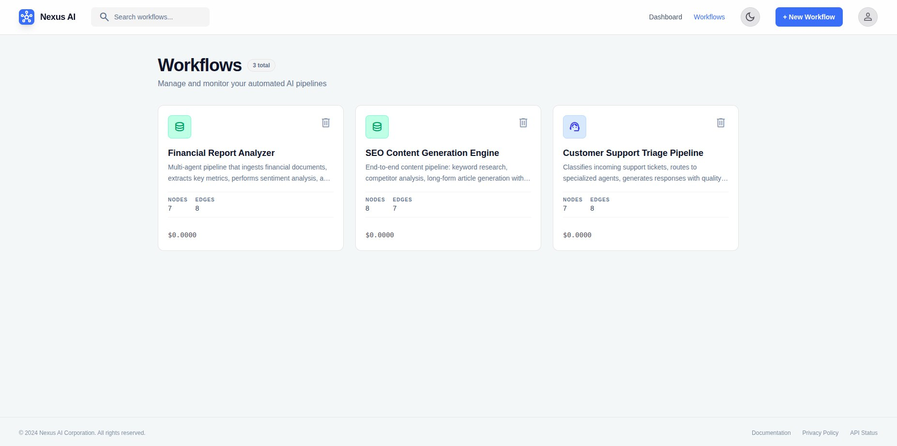
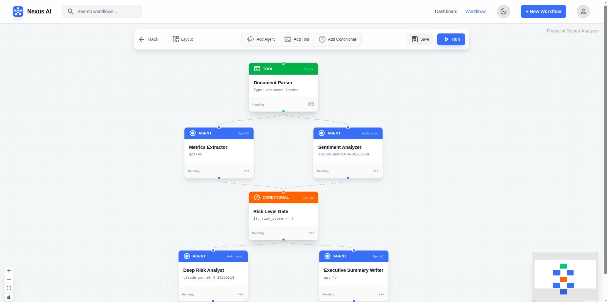
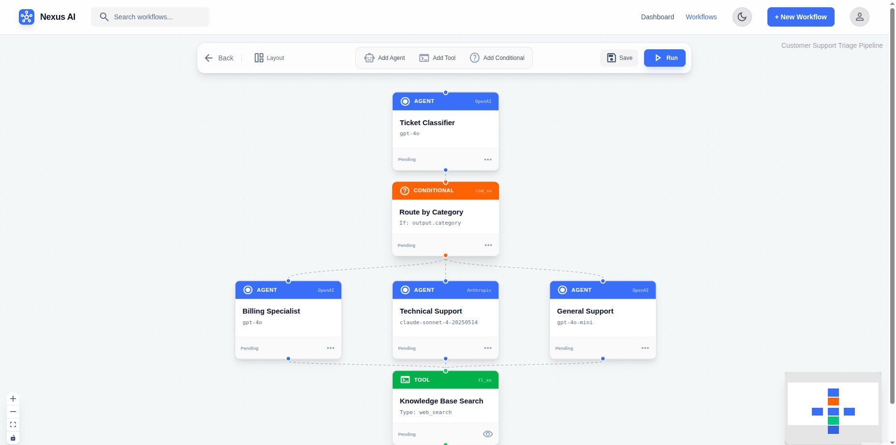

# nexus-ai

Multi-agent AI orchestration with DAG execution, backtracking, and budget planning.

Most agent frameworks are sequential wrappers around LLM calls — a for-loop that fires agents one at a time with no dependency awareness, no parallelism, and no cost control. nexus-ai treats multi-agent orchestration as a graph scheduling problem instead.

You build workflows visually, the engine resolves them into dependency-aware execution plans, runs agents in optimal parallel order, handles failures through retries and fallbacks, and enforces resource budgets in real-time — streaming every state change to a reactive frontend.



---

## Core ideas

**DAG-based execution.** Workflows are directed acyclic graphs. The planner topologically sorts nodes via Kahn's algorithm and extracts parallel groups — agents with no mutual dependencies run concurrently. A 5-agent linear chain takes 5 rounds; reshape it into a diamond and it takes 3. Complexity is O(V + E) for resolution, and execution time is bounded by the critical path, not the total agent count.

**Backtracking on failure.** When an agent fails, the engine retries with exponential backoff (1s → 2s → 4s, capped at 10s), then falls back to a designated alternative agent. Downstream nodes with failed dependencies are skipped automatically. Independent branches keep running — one failure doesn't kill the whole workflow.

**Resource budget planning.** Before execution, the planner estimates token costs using model pricing data and output heuristics. Set a ceiling and the enforcer tracks spend per-agent in real time, warning at 80% and halting new agents at 100%. Over budget? The suggestion engine ranks model downgrades and optional agent cuts by savings.

**Visual workflow builder.** Drag-and-drop ReactFlow canvas with agent, tool, and conditional node types. Auto-layout via dagre. The same graph you build becomes the live execution overlay — nodes light up as agents run.





---

## Quick start

```bash
git clone https://github.com/shivang-goliyan/Nexus-AI.git
cd Nexus-AI

cp .env.example .env
# Add your OPENAI_API_KEY and/or ANTHROPIC_API_KEY

docker-compose up --build
```

First startup runs database migrations automatically. Give it ~30s for services to come up, then open [http://localhost:3000](http://localhost:3000).

| Service | Port | Purpose |
|---------|------|---------|
| Frontend | 3000 | Visual builder + execution UI |
| Backend API | 8000 | REST + WebSocket endpoints |
| PostgreSQL | 5432 | Workflows, executions, vector memory |
| Redis | 6379 | Task queue + real-time event pub/sub |

---

## How the engine works

The short version:

1. Build a workflow graph in the visual editor — agents, tools, conditionals, edges
2. Hit Run — backend parses the graph into a DAG
3. Kahn's algorithm validates acyclicity and produces a topological ordering
4. Parallel group extraction identifies which agents can run simultaneously
5. Executor iterates groups, running each group's agents concurrently via `asyncio.gather()`
6. Failed agents retry with backoff, then fall back to alternatives. Downstream deps are skipped; independent branches continue
7. Budget enforcer tracks cost per agent and halts execution if the ceiling is hit
8. Every state transition publishes to Redis → WebSocket → live UI

---

## API

```
GET    /api/v1/health                     Health check
GET    /api/v1/workflows                  List workflows
POST   /api/v1/workflows                  Create workflow
GET    /api/v1/workflows/:id              Get workflow
PUT    /api/v1/workflows/:id              Update workflow
DELETE /api/v1/workflows/:id              Delete workflow
POST   /api/v1/workflows/:id/execute      Execute workflow
GET    /api/v1/workflows/:id/executions   Execution history
GET    /api/v1/executions/:id             Execution detail
WS     /ws/executions/:id                 Live execution stream
```

---

## Architecture

```
┌─────────────────────────────────────────────────────────────┐
│  Frontend (Next.js 14)                                      │
│  ┌──────────┐  ┌──────────────┐  ┌───────────────────────┐  │
│  │ ReactFlow│  │ Exec Viewer  │  │ History / Detail Pages │  │
│  │ Canvas   │  │ (WebSocket)  │  │                       │  │
│  └────┬─────┘  └───────┬──────┘  └───────────┬───────────┘  │
│       └────────┬───────┴──────────────────────┘              │
│                │ REST + WebSocket                            │
└────────────────┼─────────────────────────────────────────────┘
                 │
┌────────────────┼─────────────────────────────────────────────┐
│  Backend (FastAPI)                                           │
│  ┌─────────────▼──────────┐                                  │
│  │  API Layer             │──────────────────┐               │
│  │  workflows / executions│                  │               │
│  └─────────────┬──────────┘                  │               │
│                │                             │               │
│                ▼                             ▼               │
│  ┌─────────────────────┐       ┌─────────────────────┐      │
│  │  Execution Engine    │       │  WebSocket Handler   │      │
│  │  ├─ DAG Planner     │       │  Redis pub/sub →     │      │
│  │  ├─ Executor        │       │  live events to UI   │      │
│  │  ├─ Backtracking    │       └──────────┬──────────┘      │
│  │  └─ Budget Enforcer │                  │               │
│  └──────────┬──────────┘                  │               │
│             │                             │               │
│             ▼                             │               │
│  ┌──────────────────┐  ┌────────────────┐ │               │
│  │  LLM Adapters    │  │  Agent Memory  │ │               │
│  │  OpenAI/Anthropic│  │  (pgvector)    │ │               │
│  └──────────────────┘  └────────────────┘ │               │
└─────────────┼─────────────────────────────┼───────────────┘
              │                             │
    ┌─────────▼─────────┐        ┌──────────▼──────────┐
    │  Celery + Redis   │        │  PostgreSQL 16      │
    │  (task queue +    │        │  + pgvector          │
    │   pub/sub)        │        │                      │
    └───────────────────┘        └──────────────────────┘
```

---

## Project structure

```
nexus-ai/
├── frontend/
│   ├── src/
│   │   ├── app/                  # Next.js pages (App Router)
│   │   ├── components/           # ReactFlow canvas, nodes, modals
│   │   ├── hooks/                # useWebSocket
│   │   └── lib/                  # API client, types
│   └── Dockerfile
├── backend/
│   ├── src/
│   │   ├── api/                  # FastAPI routes
│   │   ├── engine/               # Planner, executor, backtracking, budget
│   │   ├── adapters/             # LLM provider adapters
│   │   ├── memory/               # pgvector semantic store
│   │   ├── models/               # SQLAlchemy ORM
│   │   ├── schemas/              # Pydantic models
│   │   ├── services/             # Business logic
│   │   └── tasks/                # Celery task definitions
│   ├── alembic/                  # Database migrations
│   └── Dockerfile
├── docs/screenshots/              # UI screenshots
├── pricing/models.json           # LLM model pricing data
├── docker-compose.yml
└── .env.example
```

---

## Tech stack

| Layer | Tech |
|-------|------|
| Frontend | Next.js 14 (App Router), TypeScript, Tailwind, ReactFlow 11 |
| Backend | Python, FastAPI, SQLAlchemy 2.0 (async), Alembic |
| Task queue | Celery + Redis |
| Database | PostgreSQL 16 + pgvector |
| Real-time | WebSockets + Redis pub/sub |
| LLM providers | OpenAI, Anthropic (adapter pattern) |
| Containers | Docker + Docker Compose |

---

## Known issues & roadmap

**Known limitations:**
- Cost estimation assumes all conditional branches execute (worst-case). Real costs are lower for branchy workflows.
- Memory embedding calls aren't included in budget estimates — cost is small but nonzero.
- 50 node cap per workflow.

**Not in V1 (intentional):**
- Auth (single-user project)
- Token-by-token streaming from agents
- Dynamic replanning on failure (engine uses static fallback paths)
- Cross-execution memory persistence
- Human-in-the-loop approval gates

**V2 ideas:**
- Tool sandbox (isolated Docker containers per tool execution)
- Workflow versioning and rollback
- Python SDK for programmatic workflow creation
- Additional LLM providers via the adapter pattern

---

## License

[MIT](LICENSE)
